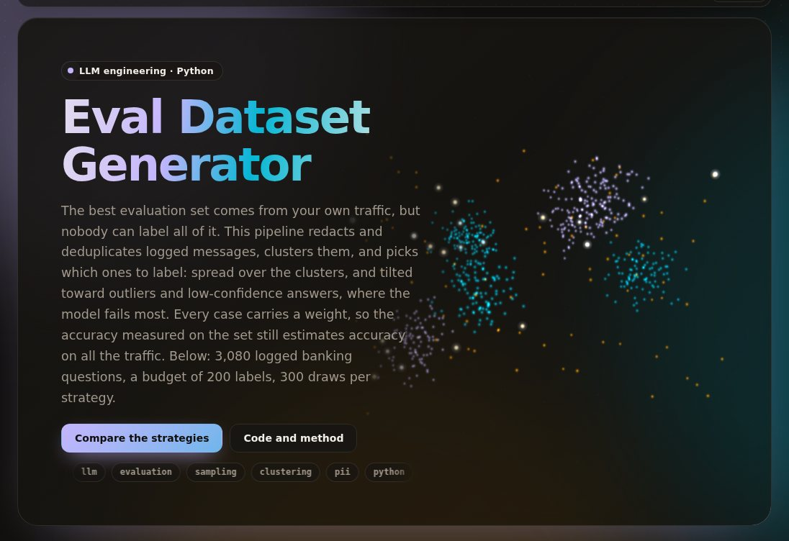

# eval-dataset-generator

[](https://github.com/umer-78/eval-dataset-generator/actions/workflows/ci.yml)

[](https://umer-78.github.io/eval-dataset-generator/)

**Live demo:** https://umer-78.github.io/eval-dataset-generator/ (three ways to spend a labelling budget, and why every case carries a weight)

It turns production LLM logs into an evaluation set that is worth labelling:

- **Ingest and redact.** Logs are ingested into one schema, validated and deduplicated. PII (emails, card numbers passing the Luhn check, IBANs, phone numbers) is redacted before storage.
- **Collapse near-duplicates.** Messages within 0.97 cosine of each other become one candidate.
- **Cluster.** Traffic is clustered into request types, with outliers flagged.
- **Sample.** A labelling budget is spent uniformly, stratified by cluster, or boosted toward trouble: low model confidence, outliers, negative feedback. Every design keeps inclusion probabilities, so the labelled set still estimates quality over *all* traffic without bias.
- **Write.** Cases go to a versioned JSON-lines file (the version is a content hash) with a manifest, ready for a labeller or an LLM judge.

## Results

`python -m evalgen bench` (about a minute). Banking77 stands in for a day of logs: 3,080 real customer messages to a bank, with 77 intents the generator never sees. They are answered by a production model, logistic regression on bge-small embeddings trained on the other 10,003 messages, which is right on 92.6% of them.

- 400 near-duplicates were collapsed.
- HDBSCAN on a 32-dimension projection found 71 request types (86% of each cluster is a single intent), plus 986 outliers.
- **Outliers fail three times as often:** 12.6% against 4.3% for clustered messages. Novel requests are where the model breaks.

A budget of 200 labelled cases, drawn 300 times per design (means):

| Strategy | Model failures captured | Intents covered (of 77) | Clusters covered | Accuracy estimate RMSE | Bias, weighted | Bias if you just average |
|---|---|---|---|---|---|---|
| uniform | 14.8 | 71.6 | 49.8 | 1.98 pts | −0.05 pts | −0.05 pts |
| stratified by cluster | 14.0 | 71.5 | 53.8 | 1.89 pts | +0.03 pts | +0.38 pts |
| **boosted** (confidence, outliers) | **25.6** | 70.2 | 37.9 | **1.43 pts** | −0.16 pts | **−5.52 pts** |

- **Boosting nearly doubles the failures per labelled case: 25.6 against 14.8.** It also *improves* the accuracy estimate (RMSE 1.43 against 1.98 points), because it spends labels where the outcome is uncertain.
- **The weights are what keep that honest.** Averaging the boosted set as if it were uniform understates the model's accuracy by 5.5 points. Weighting each case by its inverse inclusion probability brings the bias to −0.16.
- **Stratifying reaches more request types** (53.8 of 71 clusters against 49.8) for a slightly better estimate. Boosting covers fewer, because it concentrates where failures are. Pick by what the set is for: regression-testing breadth or finding bugs.

The first cases of a built set, with the gold label a labeller would add (Banking77, CC BY 4.0), are in `results/bench.md`.

## Use

```python
from evalgen.logs import ingest
from evalgen.build import clusters, near_duplicates, sample, signal, estimate, write

entries, report = ingest(open("calls.jsonl"))               # validated, deduplicated, redacted
vectors = embed([e.prompt for e in entries])                # any sentence embedder; bge-small is in evalgen/embed.py
labels, names = clusters(vectors, [e.prompt for e in entries])
weights = signal([e.confidence for e in entries], labels == -1, [e.feedback for e in entries])
idx, pi = sample("boosted", 200, rng, strata=labels, weights=weights)
version = write([{"prompt": entries[i].prompt, "production_answer": entries[i].response,
                  "expected": None, "weight": 1 / p} for i, p in zip(idx, pi)], path, {"strategy": "boosted"})
# after labelling: estimate(correct, pi) is the quality over all traffic
```

```bash
pip install -e '.[dev]'
pytest -q
python -m evalgen bench
python -m evalgen.demo    # rebuild the live demo's data in docs/
```

Banking77 and the bge-small model, each pinned by SHA-256, are downloaded on first use into `~/.cache/evalgen`; nothing is committed.

## Licence

MIT licence (see [LICENSE](LICENSE)). The data it evaluates (Banking77 (CC BY 4.0) and the bge-small model) keeps its own licence and is downloaded when you run it.
